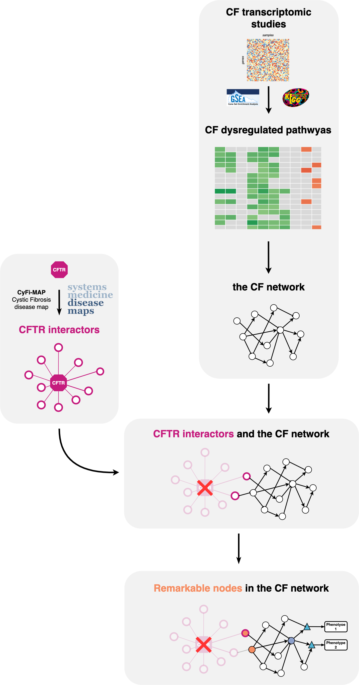

# Construction of the CF signaling network

This repository contains scripts and data to reproduce the construction and the analysis of the CF signalling network. The overall network can be accessed as a Cytoscape session, in the [sysbio-curie/CFnetwork_cystoscape](https://github.com/sysbio-curie/CFnetwork_cytoscape.git) github repository for further analysis. 

Explore the following sections to understand the content and purpose of each file:

## I. Differential Expression Analysis at the Gene Level

- **DEG_comparison.Rmd** - Compare differentially expressed genes.
Dependencies: 
  - deg_utils.R

## II. Differential Expression Analysis at the Pathway Level

- **fGSEA_comparison.Rmd** - Perform pathway-level differential expression analysis (starting from line 282).
Dependencies: 
    - Fgsea_output_preprocess.R
    - Fgsea_comparison_utils.R

## III. KEGG Pathways Preprocessing

- **kegg_pathways_preprocess.R** - Retrieve KEGG signaling pathways.
Outputs:
    - Kegg_from_omnipathR_gsea_2022_09_07.gmt
    - Kegg_pathways_from_omnipathR.txt
    - kegg_pathways_from_omnipath_list.Rdata
    - Kegg_pathways_from_omnipath_nodes_carac.Rdata

- **kegg_pathways_utils.R** - Download KEGG pathway data.
  - Downloads: Kegg_pathways_from_omnipath_nodes_carac_corrected and effect_arrow.df

## IV. Differential KEGG Pathways Network

- **kegg_diff_pathways.Rmd** - Correct and merge dysregulated pathways into a single network.
Dependencies:
    - Kegg_pathways_manual_curation.R: Correct KEGG signaling pathways.
    - Network_utils.R

Optional: Add CFTR interactors.
    - **Extract_CyFi_MAP_CFTR_interactors.R** - Extract CFTR interactors.
    - **CyFi_MAP_helper.R** - Transform complexes to proteins.
        Outputs:
            - CFTR_interactors_interactions_df_2023_07_07.Rdata
            - CFTR_interactors_nodes_df_2023_07_07.Rdata

- **CFTR_interactors_helper.R** - Extend to CFTR interactor.
  - Inputs: Kegg_pathways_corrections_w_EZR_2022_06_07.txt
  - Outputs:
    - Kegg_diff_pathways_interactions_with_CFTR_interactors_df_2022_12_01.RData: Interactions in data.frame format.
    - Kegg_diff_pathways_nodes_with_CFTR_interactors_df_2022_12_01.RData: Nodes in data.frame format.

- **Kegg_diff_pathways_layout.R** - Pathway network layout.

- **Kegg_diff_pathways_network_analysis.R** - Network analysis for differential KEGG pathways.

Scripts were designed by Matthieu Najm (matthieu dot najm at minesparis dot psl dot eu). See a complete list of authors in the corresponding paper.
Feel free to explore, run, and adapt these scripts to suit your analysis needs. If you have any questions or need assistance, please don't hesitate to reach out.
